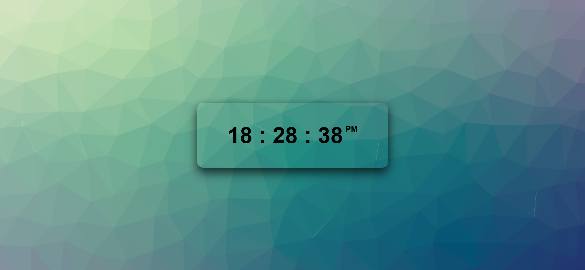

# Digital-Clock
✨This project is a simple, modern, and fully functional digital clock built using HTML, CSS, and JavaScript. It dynamically displays the current time and updates every second.

  🚀 Features

  
  ✅ Real-time digital clock with automatic updates

  ✅ Clean and minimal user interface

  ✅ Responsive design – works on desktop and mobile

  ✅ 12-hour or 24-hour format (customizable)

  ✅ Lightweight and easy to integrate

🚀 Technologies Used

  ✅ HTML – Structure of the clock

  ✅ CSS – Styling and layout

  ✅ JavaScript – Time logic and live updates

git add .
git commit -m "Add screenshot to README"
git push
